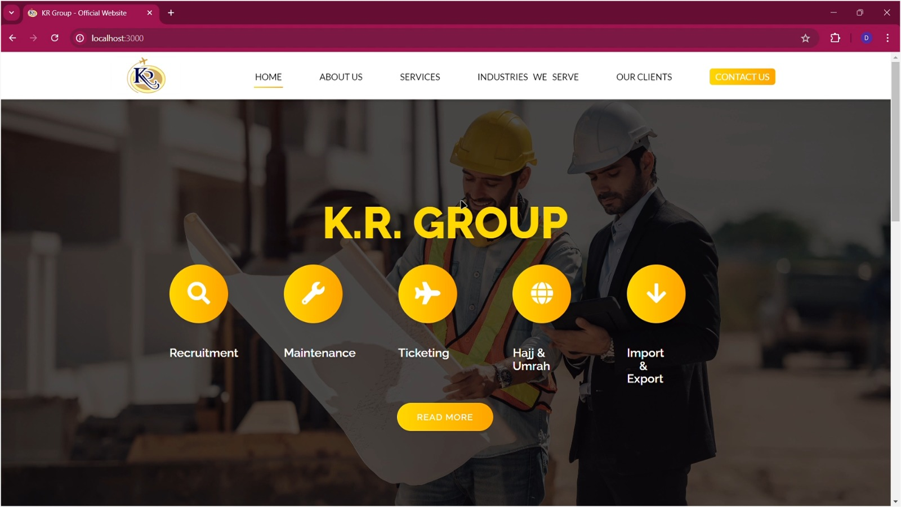
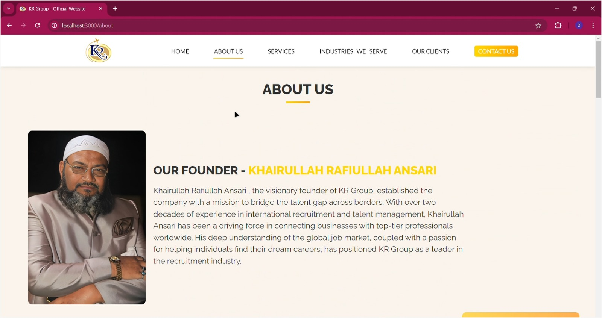
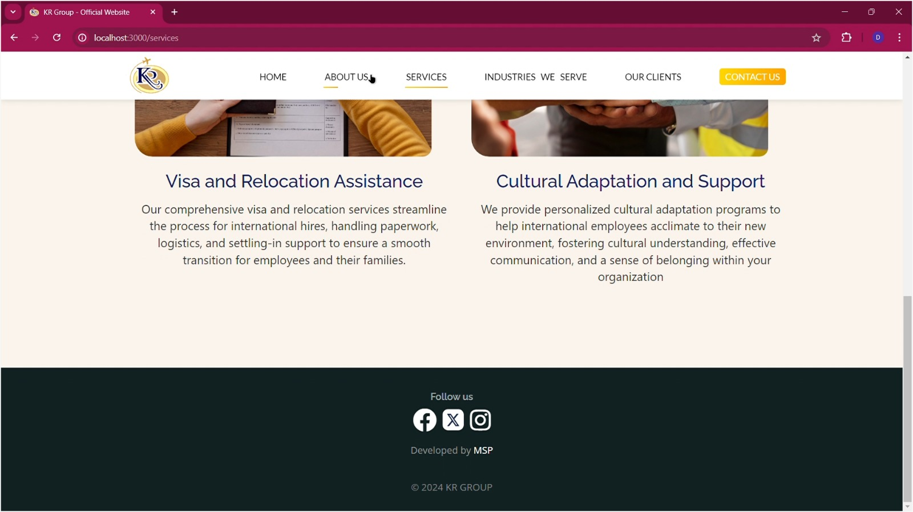

# KR GROUP OFFICIAL WEBSITE

Welcome to the official website of KR GROUP. This project is designed to provide an intuitive and professional online presence for our company, showcasing our services, team, and contact information.

## Features
- Modern and responsive design
- Interactive UI with React.js
- Footer with FontAwesome icons for social media (Facebook, X (Twitter), Instagram)
- Optimized performance and smooth navigation
- Clean and minimalistic layout

## Demo
Explore the live version of the website through the screenshots and demo video posted in this repository.

## Installation
To run this project locally, follow these steps:

1. Clone the repository:
   ```bash
   git clone https://github.com/MohammadSahil007/KR-GROUP-.git
   ```
2. Navigate to the project directory:
   ```bash
   cd kr-group-official-website
   ```
3. Install dependencies:
   ```bash
   npm install
   ```
4. Start the development server:
   ```bash
   npm start
   ```

## Tech Stack
- React.js
- FontAwesome for icons
- CSS for styling
- Node.js (for backend if applicable)
- MongoDB (if database integration is included)

## Screenshots & Video





[](https://github.com/your-username/your-repo/raw/main/KR-VID.mp4)


## Contributing
We welcome contributions! Feel free to fork this repository, submit pull requests, or open issues for improvements.

## License
This project is licensed under the MIT License.

## Contact
For inquiries, partnerships, or feedback, reach out via our official email: [ansarisahileager@gmail.com] or connect with us on social media.

